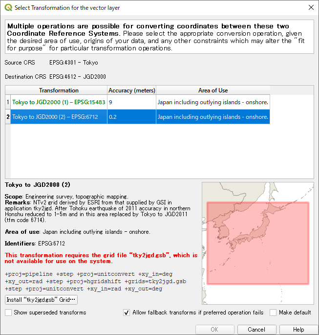

# proj-datumgrid-japan

## はじめに

このページで公開しているファイルは、国土地理院が提供する[座標補正パラメータファイル](https://www.gsi.go.jp/sokuchikijun/sokuchikijun41012.html#zahyo)を、 GIS ユーティリティである Proj で利用できるように形式を変換した NTv2 (gsb) ファイルです。

測量法では公共測量の成果を使用・複製するときは申請し許諾を得る必要がありますが、国土地理院に確認したところ補正パラメータは公共測量成果ではないと回答をいただいておりますので、[国土地理院コンテンツ利用規約](https://www.gsi.go.jp/kikakuchousei/kikakuchousei40182.html)に従い、出典を明示するとともに形式の変換ならびに頒布するものです。

## 注意事項

測量成果の改定を行うには、改測、改算およびパラメータを使用した補正の手法があります。本ページで頒布する NTv2 (gsb) ファイルはパラメータによる補正で使用するファイルです。

内陸型地震の震央付近や液状化等で複雑な変動を示した地域に関してはパラメータを使用した補正は不適切であり、改測や改算を行うことが妥当な場合があります。また、そのような地域ではパラメータが欠損していることがあります。その場合は、該当地域の座標を変換しても補正が行われないことに留意してください。

また、地域によっては複数の大地震があり、パラメータファイルが複数存在することがあります。その場合は測量した時期により適切に補正を行う必要があります。

公共測量の改定を行う場合には、点検を行い、国土地理院の[測量計算サイト](https://vldb.gsi.go.jp/sokuchi/surveycalc/main.html)等と同等であることを計画機関に承認を得る必要があります。（ NTv2 (gsb) ファイルはパラメータファイルを形式変換したものであり、補正結果の精度は使用するツールのアルゴリズムに依ります。）

詳細については[各パラメータファイルの留意点](https://www.gsi.go.jp/sokuchikijun/sokuchikijun41012.html)および[公共測量改定マニュアル (PDF)](https://psgsv2.gsi.go.jp/koukyou/download/patch/patch_manual.pdf) を参照してください。

## 変換スクリプト

国土地理院から新しいパラメータファイルの提供、あるいは既存ファイルの改定が行われることがあります。そのような場合は、リポジトリ内のスクリプトを使用して NTv2 (gsb) ファイルに変換することができます。

## QGIS における使い方

下記の変換に関しては ESRI ArcGIS で NTv2 ファイルを用いた方法が使われているため、変換手法として EPSG に登録されています。

* Tokyo to JGD2000 (2) [EPSG:6712]
  * tky2jgd.gsb が必要（国土地理院のパラメータファイル名に従い TKY2JGD.gsb としていますが、リネームされます。）
* JGD2000 to JGD2011 (1) [EPSG:6713]
  * touhokutaiheiyouoki2011.gsb が必要

このため、これらの再投影が行われる際には NTv2 ファイルを利用した方法も選択肢として選ぶことができます。

NTv2 ファイルが存在しないため導入を促すメッセージが表示されますが、ダイアログ内のボタンから NTv2 ファイルを選択することで導入できます。その後 QGIS の再起動が必要となります。

